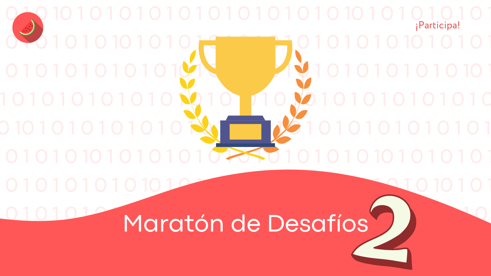

 
Estos son los desafíos de WatermelonCode resuletos en C++ a manera de práctica del lenguaje.

<a href="https://github.com/franciscomunozz/desafioswatermeloncode/week1"><button style="border: none; padding: 10px; font-size:15px; background-color:#FF5757; color: white;border-radius: 15px">First Week</button></a>